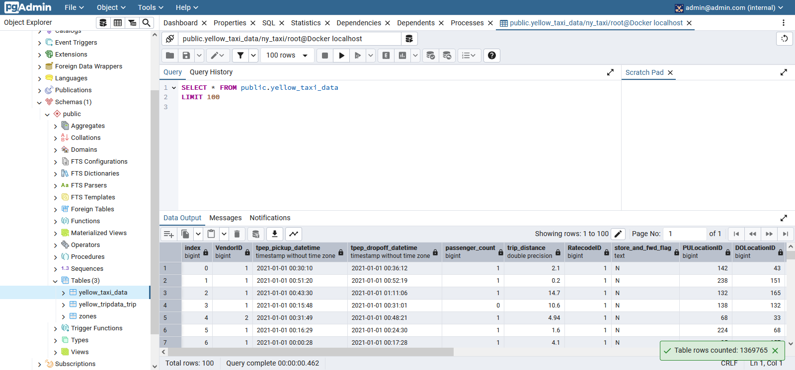

<p align="center">
    
</p>

# Module 1: Containerization and Infrastructure as Code

* Course overview
* Introduction to GCP
* Docker and docker-compose
* Running Postgres locally with Docker
* Setting up infrastructure on GCP with Terraform
* Preparing the environment for the course
* Homework 

## 🐳 Docker & SQL 🗄️

The dataset we'll be using is the **Taxi Rides NY dataset**. 🚖📊

---

### 1 - 🐋 **Introduction to Docker** 🐋

Docker is a **powerful platform** that helps developers build, share, and run **containerized applications**. 🚀 Containers are like lightweight, isolated environments that can run applications independently. For data engineers, Docker is a game-changer! 🎮

**Why Docker?** 🤔  
Imagine running a **data pipeline** in a container. A data pipeline is a process that takes input data, processes it (e.g., cleaning, transforming), and produces output data. For example, a Python script that takes a CSV file, processes it, and stores the results in a Postgres database. 🐍📂➡️🗄️

With Docker, you can run **multiple data pipelines** simultaneously, each in its own container, without any interference. 🚦 You can even run databases like **Postgres** and tools like **pgAdmin** in separate containers, and they can communicate seamlessly. 🤝


#### 🛠️ **Why Should Data Engineers Care About Docker?** 🛠️

1. **Reproducibility** 🔄  
   Docker images act as **snapshots** of a container's environment. This ensures that the same code and dependencies run identically across different machines. No more "it works on my machine" issues! 🖥️✅

2. **Local Experiments & Testing** 🧪  
   Docker allows you to set up and run **local experiments** and integration tests (CI/CD: Continuous Integration/Continuous Delivery) without installing software directly on your host machine. This makes testing data pipelines in a controlled environment a breeze. 🌬️

3. **Cloud Deployment** ☁️  
   Docker images can be easily deployed to cloud environments like **Google Cloud Kubernetes**, **AWS Batch**, or serverless platforms like **AWS Lambda** and **Google Cloud Functions**. This ensures consistent code execution in production. 🚀


#### 🚀 **Getting Started with Docker** 🚀

Let's create a directory for our project:  
```bash
mkdir 2_docker_sql
```

Inside this directory, we'll create a [**Dockerfile**](./2_docker_sql/Dockerfile). But first, let's get familiar with Docker by running some basic commands:

1. **Hello World** 🌍  
   ```bash
   docker run hello-world
   ```

2. **Interactive Ubuntu Container** 🐧  
   ```bash
   docker run -it ubuntu bash
   ```
   - `run`: Runs the image.
   - `-it`: Interactive mode.
   - `ubuntu`: The environment we want to run.
   - `bash`: The command to execute in the container.

   💡 **Pro Tip**: Even if you delete everything inside the container (`rm -rf / --no-preserve-root`), the next time you run it, all files will be restored. Containers are **isolated** and don't retain changes between runs. 🧼

3. **Python 3.9 Container** 🐍  
   ```bash
   docker run -it python:3.9
   ```
   - `3.9`: The tag specifying the Python version.
   - To get into bash, overwrite the entrypoint:
     ```bash
     docker run -it --entrypoint bash python:3.9
     ```


#### 🛠️ **Creating a Dockerfile** 🛠️

Since changes made in a container are discarded after each run, we need a **Dockerfile** to build containers with specific instructions. Here's an [example](./2_docker_sql/Dockerfile):

```docker
FROM python:3.9.1  # Base image 🐍

RUN pip install pandas  # Install pandas library 📦

ENTRYPOINT [ "bash" ]  # Overwrite the entrypoint 🚪
```

**Build the Docker Image** 🔨  
```bash
docker build -t test:pandas .
```
- `test:pandas`: Image name and version.
- `.`: Build from the Dockerfile in the current directory.

**Run the Docker Image** 🏃‍♂️  
```bash
docker run -it test:pandas
```
Now, every time you run this image, **pandas** will be available. 🐼


#### 📂 **Adding a Data Pipeline** 📂

Let's create a [Python script](./2_docker_sql/pipeline.py) (`pipeline.py`) and add it to our container. Update the Dockerfile:

```docker
WORKDIR /app  # Set the working directory 📁
COPY pipeline.py pipeline.py  # Copy the script into the container 📄
```

Now, when you run the container, the current directory will be `/app`, and you'll see your data pipeline script there. 🗂️

To make the pipeline run automatically using specified arguments, we will first, update the script to accept **command-line arguments** (`sys.argv`), and then, overwrite the entrypoint to run the script:

```docker
ENTRYPOINT [ "python", "pipeline.py" ]
```

**Run the Image with Arguments** 🏃‍♀️  
```bash
docker run -it test:pandas 2025-01-25 hello 37
```
All arguments after the image name are passed to the script. 🎯

---

##### 🎉 **Summary** 🎉

Docker is a **must-have tool** for data engineers. It ensures **reproducibility**, simplifies **local testing**, and streamlines **cloud deployment**. With Docker, you can run multiple pipelines and services in isolated environments, making your workflows more efficient and reliable. 🚀

Now, go ahead and containerize your data pipelines! 🐳✨

---

### 2 - 🚕 Ingesting NY Taxi Data into Postgres 🗂️

Let's dive into running **Postgres in Docker** and building a **data pipeline** using Python scripts to load the NY Taxi dataset into a Postgres database. Here's how to get started:


#### 🐳 Running Postgres in Docker

To run the **Postgres:13** image in Docker, use the following command:

```bash
docker run -it \  # Run the Docker image in interactive mode
   -e POSTGRES_USER="root" \  # Set the username
   -e POSTGRES_PASSWORD="root" \  # Set the password
   -e POSTGRES_DB="ny_taxi" \  # Set the database name
   -v $(pwd)/ny_taxi_postgres_data:/var/lib/postgresql/data \  # Mount a volume for persistent data storage
   -p 5432:5432 \  # Map port 5432 on the host to port 5432 in the container
   postgres:13  # Specify the Docker image
```

##### Key Points:
- **`-e` flag**: Used to set environment variables (e.g., username, password, database name).
- **Volume Mounting**: Maps a folder on your host machine (`ny_taxi_postgres_data`) to a folder in the container. This ensures data persistence even after the container stops. 
  - 💡 **Pro Tip**: Create the folder first with `mkdir ny_taxi_postgres_data`.
- **Port Mapping**: Maps port `5432` on your host to the container's port `5432` to allow SQL queries.


#### 🛠️ Troubleshooting Empty Folders

If the `ny_taxi_postgres_data` folder appears empty after running the container:
1. **Delete the folder** and run the Docker command again (it will recreate the folder).
2. Adjust folder permissions with:
   ```bash
   sudo chmod a+rwx ny_taxi_postgres_data
   ```
   This ensures you can see the configuration files.


#### 🔑 Accessing the Database with `pgcli`

To interact with the database, we'll use **`pgcli`**, a powerful CLI client for Postgres. Install it with:
```bash
pip install pgcli
```

Then, log into the database:
```bash
pgcli -h localhost -p 5432 -u root -d ny_taxi
```
- **Password**: `root`
- **Commands**:
  - List tables: `\dt`
  - Test the connection: `SELECT 1;`


#### 📊 Loading the Dataset with Jupyter Notebooks

We'll use **Jupyter Notebooks** to load the dataset. If you don't have Jupyter installed:
```bash
pip install jupyter
```

Start Jupyter:
```bash
jupyter notebook
```

##### Dataset Details:
- **Yellow Taxi Dataset (Jan 2021)**: [Download Link](https://github.com/DataTalksClub/nyc-tlc-data/releases/download/yellow/yellow_tripdata_2021-01.csv.gz)
- **Data Dictionary**: [Check Here](https://www.nyc.gov/assets/tlc/downloads/pdf/data_dictionary_trip_records_yellow.pdf)

##### Steps:
1. Use the [upload-data notebook](./2_docker_sql/01-upload-data.ipynb) to download the dataset, create the `yellow_taxi_data` table in the database.
2. Verify the table with `pgcli`:
   - List tables: `\dt;`
   - Describe the table: `\d yellow_taxi_data;`
3. Load data into the table using the [upload-data notebook](./2_docker_sql/01-upload-data.ipynb) and verify with `pgcli`:
   ```sql
   SELECT COUNT(*) FROM yellow_taxi_data;
   ```


#### 🧪 Testing the Connection without pgcli

You can also use [this notebook](./2_docker_sql/02-pg-test-connection.ipynb) to test the Postgres connection and ensure everything works smoothly.


##### 🚀 Final Notes
- Use **VS Code** or **PyCharm** as alternatives to Jupyter.
- If you don't see the `ny_taxi_data` folder in Jupyter, adjust permissions:
  ```bash
  sudo chmod a+rwx ny_taxi_postgres_data
  ```

---

### 🚀 3 - Connecting PgAdmin and PostgreSQL  

Let's start by running our PostgreSQL database using the following command:  

```bash
docker run -it \
   -e POSTGRES_USER="root" \
   -e POSTGRES_PASSWORD="root" \
   -e POSTGRES_DB="ny_taxi" \ 
   -v $(pwd)/ny_taxi_postgres_data:/var/lib/postgresql/data \ 
   -p 5432:5432 \  
   postgres:13 
```

Next, let's connect to the database using `pgcli`:

```bash
pgcli -h localhost -p 5432 -u root -d ny_taxi
```

To ensure our data is stored correctly, let's run a simple query: 

```sql
SELECT MAX(tpep_pickup_datetime), MIN(tpep_pickup_datetime), MAX(total_amount)
FROM yellow_taxi_data;
```

#### 🎨 Why Use PgAdmin?  

While `pgcli` is useful, its command-line interface isn't the most convenient for exploring data. This is where **pgAdmin**, a web-based GUI for PostgreSQL, comes in handy! Instead of installing it manually, we can run it using Docker.  

To start **PgAdmin** in Docker, use the following command:  

```bash
docker run -it \ 
   -e PGADMIN_DEFAULT_EMAIL="admin@admin.com" \ 
   -e PGADMIN_DEFAULT_PASSWORD="root" \ 
   -p 8080:80 \ 
   dpage/pgadmin4
```

##### 🔑 Understanding the Parameters

- **`PGADMIN_DEFAULT_EMAIL`**: The username to log into PgAdmin.  
- **`PGADMIN_DEFAULT_PASSWORD`**: The password for authentication.  
- **`-p 8080:80`**: Maps port `8080` on our host machine to port `80` in the PgAdmin container, so that requests to `localhost:8080` are forwarded correctly.  

Once this is done, open your browser and visit **`localhost:8080`**. Log in using:  
- **Username**: `admin@admin.com`  
- **Password**: `root`  

#### 🔗 Connecting PostgreSQL and PgAdmin  

To connect to our database, we need to create a new server:  
1️⃣ Right-click on **Servers** → **Register** → **Server**  
2️⃣ Set **Name** to `"Local Docker"`  
3️⃣ Under **Connection**, enter:  
   - **Host**: `localhost`  
   - **Username**: `root`  
   - **Password**: `root`  

`localhost` means that the docker image of pgAdmin will be looking for `postgres` inside itself. However, PgAdmin runs inside a separate Docker container, so it can't directly see our PostgreSQL database. To fix this, we need to link both containers within the same network.

##### 🌐 Creating a Docker Network  

Run the following command to create a network:  

```bash
docker network create pg-network
```

Now, restart both PostgreSQL and PgAdmin while assigning them to this network:  

```bash
docker run -it \
   -e POSTGRES_USER="root" \
   -e POSTGRES_PASSWORD="root" \
   -e POSTGRES_DB="ny_taxi" \ 
   -v $(pwd)/ny_taxi_postgres_data:/var/lib/postgresql/data \ 
   -p 5432:5432 \ 
   --network=pg-network \ 
   --name pg-database \
   postgres:13 
```

```bash
docker run -it \ 
   -e PGADMIN_DEFAULT_EMAIL="admin@admin.com" \ 
   -e PGADMIN_DEFAULT_PASSWORD="root" \ 
   -p 8080:80 \ 
   --network=pg-network \
   --name pg-admin \
   dpage/pgadmin4
```

##### 🏗️ Key Additions  
- **`--network=pg-network`**: Ensures that both containers are in the same network, so they can communicate.  
- **`--name pg-database`**: Assigns a name to our PostgreSQL container (for pgAdmin to find out how to connect to it).  
- **`--name pg-admin`**: Assigns a name to the PgAdmin container (less critical since nothing connects to it).  

#### ✅ Final Steps  

Go back to PgAdmin, log in, and register a new server:  
- **Name**: `"Docker Localhost"`  
- **Host**: `pg-database`  
- **Username**: `root`  
- **Password**: `root`  

Now, everything should work smoothly! 🎉 We can explore our database visually and even run queries using the built-in query tool.  

📸 **Preview:**


---

### 4 - Dockerizing the Ingestion script

We used a [notebook](./2_docker_sql/01-upload-data.ipynb) to load data into our postgres database. However, let's turn it into a script so we get a data pipeline. To convert our notebook to a script, we can use the command:
```bash
jupyter nbconvert --to=script 01-upload-data.ipynb
```
After renaming it, we can now prepare this [script](./2_docker_sql/ingest_data.py) to ingest data (take data and put it into a database).


---