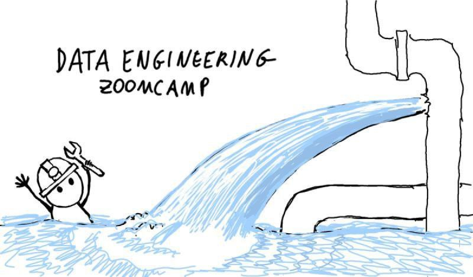

<p align="center">
    
</p>

# Module 1: Containerization and Infrastructure as Code

* Course overview
* Introduction to GCP
* Docker and docker-compose
* Running Postgres locally with Docker
* Setting up infrastructure on GCP with Terraform
* Preparing the environment for the course
* Homework 

## 🐳 Docker & SQL 🗄️

The dataset we'll be using is the **Taxi Rides NY dataset**. 🚖📊

---

### 🐋 **Introduction to Docker** 🐋

Docker is a **powerful platform** that helps developers build, share, and run **containerized applications**. 🚀 Containers are like lightweight, isolated environments that can run applications independently. For data engineers, Docker is a game-changer! 🎮

**Why Docker?** 🤔  
Imagine running a **data pipeline** in a container. A data pipeline is a process that takes input data, processes it (e.g., cleaning, transforming), and produces output data. For example, a Python script that takes a CSV file, processes it, and stores the results in a Postgres database. 🐍📂➡️🗄️

With Docker, you can run **multiple data pipelines** simultaneously, each in its own container, without any interference. 🚦 You can even run databases like **Postgres** and tools like **pgAdmin** in separate containers, and they can communicate seamlessly. 🤝

---

#### 🛠️ **Why Should Data Engineers Care About Docker?** 🛠️

1. **Reproducibility** 🔄  
   Docker images act as **snapshots** of a container's environment. This ensures that the same code and dependencies run identically across different machines. No more "it works on my machine" issues! 🖥️✅

2. **Local Experiments & Testing** 🧪  
   Docker allows you to set up and run **local experiments** and integration tests (CI/CD: Continuous Integration/Continuous Delivery) without installing software directly on your host machine. This makes testing data pipelines in a controlled environment a breeze. 🌬️

3. **Cloud Deployment** ☁️  
   Docker images can be easily deployed to cloud environments like **Google Cloud Kubernetes**, **AWS Batch**, or serverless platforms like **AWS Lambda** and **Google Cloud Functions**. This ensures consistent code execution in production. 🚀

---

#### 🚀 **Getting Started with Docker** 🚀

Let’s create a directory for our project:  
```bash
mkdir 2_docker_sql
```

Inside this directory, we’ll create a [**Dockerfile**](./2_docker_sql/Dockerfile). But first, let’s get familiar with Docker by running some basic commands:

1. **Hello World** 🌍 
   ```bash
   docker run hello-world
   ```

2. **Interactive Ubuntu Container** 🐧 
   ```bash
   docker run -it ubuntu bash
   ```
   - `run`: Runs the image.
   - `-it`: Interactive mode.
   - `ubuntu`: The environment we want to run.
   - `bash`: The command to execute in the container.

   💡 **Pro Tip**: Even if you delete everything inside the container (`rm -rf / --no-preserve-root`), the next time you run it, all files will be restored. Containers are **isolated** and don’t retain changes between runs. 🧼

3. **Python 3.9 Container** 🐍  
   ```bash
   docker run -it python:3.9
   ```
   - `3.9`: The tag specifying the Python version.
   - To get into bash, overwrite the entrypoint:
     ```bash
     docker run -it --entrypoint bash python:3.9
     ```

---

#### 🛠️ **Creating a Dockerfile** 🛠️

Since changes made in a container are discarded after each run, we need a **Dockerfile** to build containers with specific instructions. Here’s an [example](./2_docker_sql/Dockerfile):

```docker
FROM python:3.9.1  # Base image 🐍

RUN pip install pandas  # Install pandas library 📦

ENTRYPOINT [ "bash" ]  # Overwrite the entrypoint 🚪
```

**Build the Docker Image** 🔨  
```bash
docker build -t test:pandas .
```
- `test:pandas`: Image name and version.
- `.`: Build from the Dockerfile in the current directory.

**Run the Docker Image** 🏃‍♂️  
```bash
docker run -it test:pandas
```
Now, every time you run this image, **pandas** will be available. 🐼

---

#### 📂 **Adding a Data Pipeline** 📂

Let’s create a [Python script](./2_docker_sql/pipeline.py) (`pipeline.py`) and add it to our container. Update the Dockerfile:

```docker
WORKDIR /app  # Set the working directory 📁
COPY pipeline.py pipeline.py  # Copy the script into the container 📄
```

Now, when you run the container, the current directory will be `/app`, and you’ll see your data pipeline script there. 🗂️

To make the pipeline run automatically using specified arguments, we will first, update the script to accept **command-line arguments** (`sys.argv`), and then, overwrite the entrypoint to run the script:

```docker
ENTRYPOINT [ "python", "pipeline.py" ]
```

**Run the Image with Arguments** 🏃‍♀️  
```bash
docker run -it test:pandas 2025-01-25 hello 37
```
All arguments after the image name are passed to the script. 🎯

---

##### 🎉 **Summary** 🎉

Docker is a **must-have tool** for data engineers. It ensures **reproducibility**, simplifies **local testing**, and streamlines **cloud deployment**. With Docker, you can run multiple pipelines and services in isolated environments, making your workflows more efficient and reliable. 🚀

Now, go ahead and containerize your data pipelines! 🐳✨

---

### Ingesting NY Taxi Data to Postgres

Now, we will run Postgres in Docker and put some data into Postgres databases using python scripts as data pipelines. To run the image Postgres:13, we can use the command
```bash
docker run -it \  # running the docker image in interactive mode
   -e POSTGRES_USER="root" \  # username
   -e POSTGRES_PASSWORD="root" \  # password
   -e POSTGRES_DB="ny_taxi" \  # database name
   -v $(pwd)/ny_taxi_postgres_data:/var/lib/postgresql/data \  # mounting the volume
   -p 5432:5432 \  # port mapping
   postgres:13 # image name
```
`-e` flag to set environment variables.
The volume part is a way of mapping the folder in our file system on the host machine (make sure to create it: `mkdir ny_taxi_postgres_data`) to a folder in the container. Postgres keeps files in a file system as it is a database. Mapping the folder in our host machine to the one in the container is called mounting and helps to make sure our data is stil in Postgres when running next time . Note that to send requests (sql queries) to our database and get replies, we need to map a port on our host machine to a port in the container. Note that we can use a CLI client for ccessing the database. We will install `pgcli` with `pip install pgcli`.


