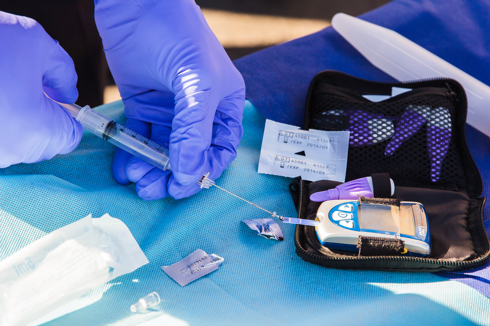

# Diabetes Predictive Modeling Project

A machine learning project to predict the onset of diabetes using diagnostic measurements.

## Table of Contents
- [Project Description](#project-description)
- [Project Structure](#project-structure)
- [Dataset](#dataset)
- [Features](#features)

## Project Description
This project focuses on building and comparing machine learning models to predict diabetes based on diagnostic features. The workflow includes:
- Exploratory Data Analysis (EDA)
- Data preprocessing and feature engineering
- Model training and evaluation
- Performance comparison of different classifiers
- Feature importance analysis

## Project Structure
Diabetes_Predictive_Modelling_Project/
├── Diabetes_Predictive_Modelling.ipynb  # Main notebook
├── diabetes.csv                         # Dataset
├── README.md                            # This file
└── Diabetes.jpg                         # An illustration

## Dataset
The Pima Indians Diabetes Dataset from [Kaggle](https://www.kaggle.com/datasets/uciml/pima-indians-diabetes-database):
- 768 samples with 8 diagnostic features
- Target variable: Binary classification (1 = diabetes, 0 = no diabetes)
- Originally from the National Institute of Diabetes and Digestive and Kidney Diseases

## Features
- Pregnancies: Number of times pregnant
- Glucose: Plasma glucose concentration
- BloodPressure: Diastolic blood pressure (mm Hg)
- SkinThickness: Triceps skin fold thickness (mm)
- Insulin: 2-Hour serum insulin (mu U/ml)
- BMI: Body mass index (weight in kg/(height in m)^2)
- DiabetesPedigreeFunction: Diabetes pedigree function
- Age: Age (years)

---
