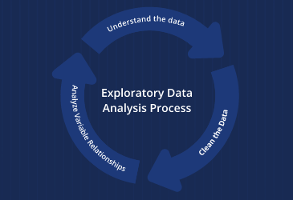
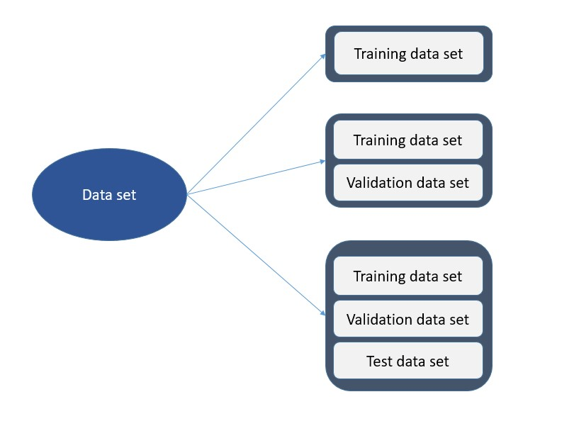
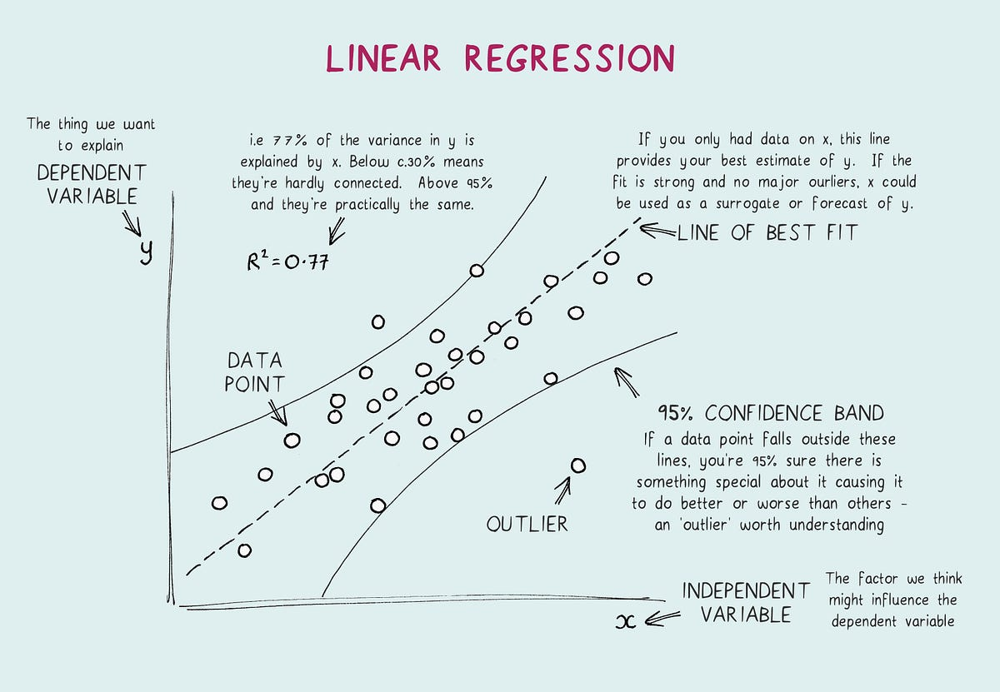
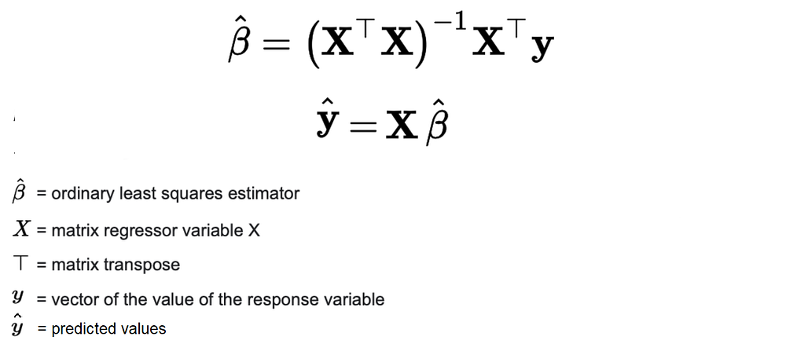
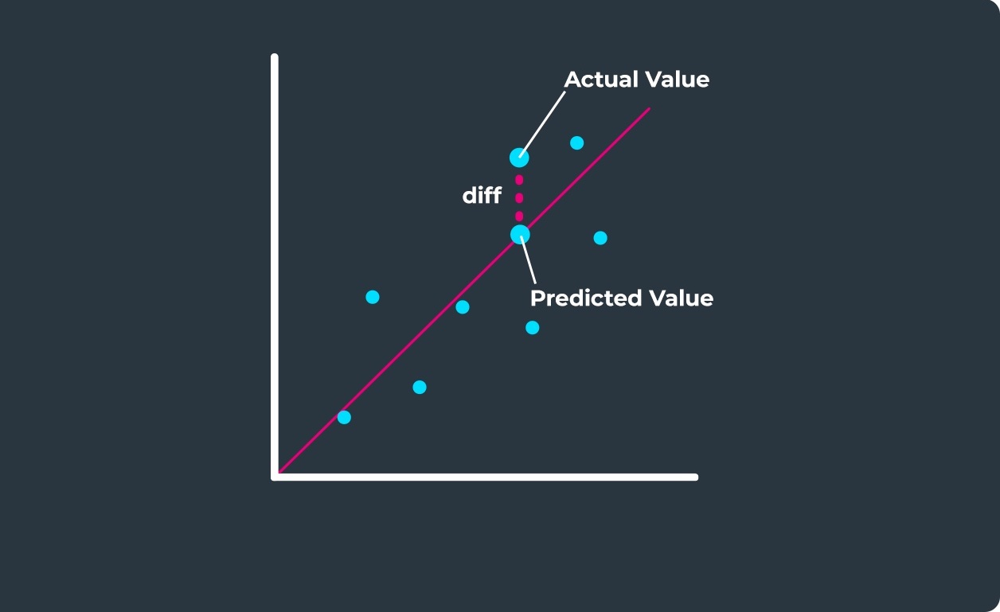
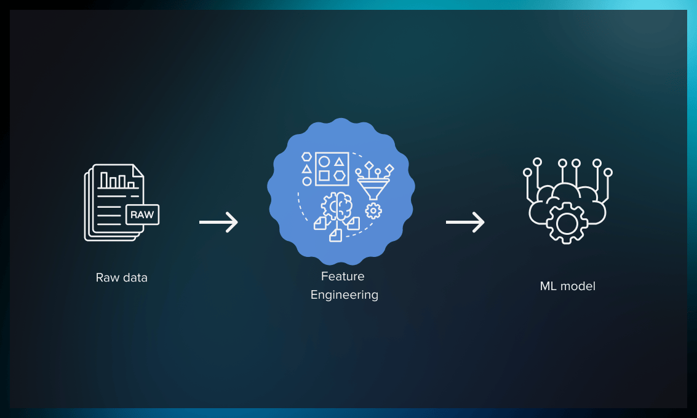
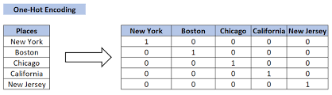

## 📚 Session 2 Summary - Machine Learning Zoomcamp

### 1. **🗺️ Project Overview: Car Price Prediction 🚗**  

A user wants to sell their car and needs help determining at which price.
   - **Goal**: Help a user determine the Manufacturer's Suggested Retail Price (MSRP) for their car.
   - **Project Plan**:
     - Data Preparation & EDA (Exploratory Data Analysis)
     - Linear Regression for price prediction
     - Understanding the internals of linear regression
     - Model evaluation using **RMSE** (Root Mean Square Error)
     - Feature Engineering to improve accuracy
     - Regularization to address numerical stability issues
     - Deploying and using the final model the model to make predictions  

### 2. **🗃️📊 Data Preparation and Exploration**

   - **Standardize Data**: Ensure consistent formats for string values.
   - **Visualize Data**: Use histograms to understand the distribution of numerical features. Observing a right-skewed distribution for car prices which could affect our model, we tried using `np.log1p` for normalization.
   - **Handle Missing Values**: Identify and fill any gaps in the data.  

### 3. **📊📏 Setting Up the Validation Framework**

   - **Dataset Split**: Split into **60-20-20** for **training**, **validation**, and **test** sets.
   - **Normalize Targets**: Apply a logarithmic transformation to normalize the target values (prices).

### 4. **📈 Linear Regression Basics**

   - **Linear Regression** is used when the target variable is a number (e.g., car prices).
   - **Model Equation**: $g(X) = y $, where $g$ is the linear regression model, $X$ is the feature matrix, and $y$ is the target price vector.
   - **Coefficient Interpretation**: Each feature $X_i$ has a corresponding coefficient $w_i$. Positive coefficients imply a positive relationship with the output, and negative coefficients imply an inverse relationship.

As the target variable was transformed with a logarithmic function, the function `np.expm1` will be used to reverse this transformation for getting the final price predictions. 

### 5. **📐 Linear Regression in Vector Form**

   - We aim to find the **coefficients or weights vector $w$** that fits our data: $Xw =y$.
   - **Solution Using the Gram Matrix**:
     - $ X^T X$ forms the **Gram Matrix**, which is square and can be inverted.
     - The formula for the coefficients vector $w$ is given by:
       $$
       w = (X^T X)^{-1} X^T y.
       $$
     - This approach allows us to compute $w$ even if $X$ is not square by utilizing $X^T X$, which is invertible if $X$ has full rank.

### 6. **🚀🔍 Baseline Model & Evaluation with RMSE**

   - **Baseline Model**: Select a subset of numerical features, replace missing values with 0s if any, train the model, predict car prices, and visualize the similarity between real values and predictions with histograms.
   - **Evaluate with RMSE**: RMSE provides an average difference between predicted and actual prices, offering a numerical measure of accuracy.

### 7. **🛠️ Feature Engineering**

   - Add new features, like **age** for the age of cars in `2017` (maximum production year for the cars in our dataset).
   - Train the model and observe improvements using validation RMSE. Histograms show improved model performance.

### 8. **🔢 Handling Categorical Variables**

   - **One-Hot Encoding** for categorical variables like **Number of Doors**: create binary columns for each possible categorical value (e.g., 2, 3, 4 doors) even if they seem numerical.
   - Including categorical variables reduced model performance. Hence the need of some regularization.  

### 9. **🔒 Regularization for Numerical Stability**

   - The **Gram Matrix** $X^T X$ may not always be invertible, particularly when columns are linearly dependent in the matrix $X$.
   - To address this, we added a small value $\lambda$ to the diagonal of $X^T X$:
     $$
     w = (X^T X + \lambda I)^{-1} X^T y.
     $$
   - This **regularization parameter** helps to stabilize the inversion, but it must be carefully tuned: neither too small nor too large, to ensure better model performance.

### 10. **⚙️ Model Tuning & Final Training**

   - **Hyperparameter Tuning**: Tune the model to find the best **regularization hyperparameter** in a bunch or range of values.
   - **Final Model**: Retrain the model on the combined training and validation sets before evaluating it on the test set.
   - **Test Results**: Made predictions on the test set, including a random car example.

---

### 💡 Key Takeaways

- **Data Preparation**: Standardized string columns and handled missing values.
- **EDA**: Identified a long-tail distribution of car prices and normalized it.
- **Validation Framework**: *Train/Validation/Test* split.
- **Linear Regression**: Implemented in simple and vector forms.
- **RMSE**: Used for evaluation since visual inspection isn't sufficient.
- **Feature Engineering**: Added new features, resulting in lower validation error.
- **One-Hot Encoding**: Integrated categorical variables, although performance decreased.
- **Regularization**: Improved numerical stability of the model and its performance.
- **Model Tuning**: Found the best regularization parameter.
- **Final Model**: Combined training and validation data, tested on the test set.
--- 