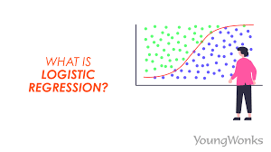

---

## 📚 Session 3 Summary - Machine Learning Zoomcamp

### 1. **🗺️ Project Overview: Churn Prediction for Telecom Companies 📞**  

   - **Goal**: Identify customers likely to churn (leave the company) and target them with promotional offers to retain their business.
   - **Project Plan**:
     - Data Preparation
     - Logistic Regression for churn prediction
     - Feature Importance evaluation through churn rate, risk ratio, mutual information, and correlation
     - Categorical Variable Encoding using One-Hot Encoding
     - Model evaluation and interpretation  

It is important to note that we do not want to offer discounts to people who are not going to leave and neither to accidently miss people who are going to leave. Hence, the model needs to be accurate minimizing both false positives and false negatives.

### 2. **🛠️ Data Preparation**

   - **String Normalization**: Ensure consistent formats across text columns, and columns names.
   - **Convert to Numerical**: Change categorical features to numeric form using encoding techniques like one-hot encoding.
   - **Missing Values**: Handle missing data appropriately, ensuring completeness.

### 3. **📏 Validation Framework**

   - **Dataset Split**: Split the data into **60-20-20** for **training**, **validation**, and **test** sets using `train_test_split` from Scikit-learn.
   - **Target Extraction**: Isolate the churn status as the target variable `y` for each set.

### 4. **🔍 Exploratory Data Analysis (EDA)**

   - **Missing Values**: Check for gaps in the training data.
   - **Global Churn Rate**: Analyze the target variable distribution and get the overall churn rate.
   - **Categorical & Numerical Features**: Review types and unique values for each variable.

### 5. **📊 Feature Importance**

   - **Churn Rate & Risk Ratio**: Compare churn rates within each category to the global churn rate. It help indicating the feature's importance.
   - **Mutual Information**: Use `mutual_info_score` from `sklearn`, to measure the relationship between categorical features and churn. Higher scores signify greater feature importance.
   - **Pearson Correlation**: Measure the correlation between numerical features and churn. Values close to ±1 indicate a strong relationship, while values near 0 suggest weak correlation.

### 6. **🔢 One-Hot Encoding**

   - **Transformation**: Convert categorical variables to binary features (1 for presence, 0 for absence) using `DictVectorizer` from Scikit-learn. This allows the logistic regression model to interpret categorical data.
   
   One encoding method consists of using a vectorizer: `from sklearn.feature_extraction import DictVectorizer`. It transforms categorical
   features without affecting numerical ones.

### 7. **📈 Logistic Regression for Churn Prediction**

   - **Binary Classification**: Logistic regression estimates the probability that a customer will churn.
   - **Model Equation**:  
     $$g(x_i) = \frac{1}{1 + e^{-(w_0 + w^T x_i)}},$$ 
     where $g(x_i)$ gives the probability that the $i^{th}$ customer will churn.

### 8. **📐 Training & Interpretation**

   - **Model Training**: Train the logistic regression model with the training dataset.
   - **Interpretation**: Use `zip()` to combine feature names with their corresponding weights. Positive weights indicate higher likelihood of churn.
   - **Model Refinement**: Train a simpler model with fewer variables to make interpretation easier.

### 9. **⚙️ Model Evaluation & Deployment**

   - **Test Set Evaluation**: Evaluate the model's accuracy on the test set. A close match between training and test accuracy indicates model stability.
   - **Use Case**: Apply the model to predict churn for new customers, allowing companies to send targeted promotional emails to those likely to leave.

---

### 💡 Key Takeaways

   - **Churn Prediction**: Identify customers at risk of leaving to optimize retention efforts.
   - **Data Preparation**: Normalize strings, convert data types, and handle missing values.
   - **Validation Framework**: Splitting data ensures reliable model evaluation.
   - **Feature Importance**: Evaluated using churn rate, risk ratio, mutual information, and Pearson correlation.
   - **Logistic Regression**: Used to predict probabilities for binary classification problems.
   - **Model Interpretation**: Analyze feature importance using model coefficients.
   - **Deployment**: Predict churn for new customers and take appropriate actions.
---
