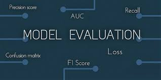
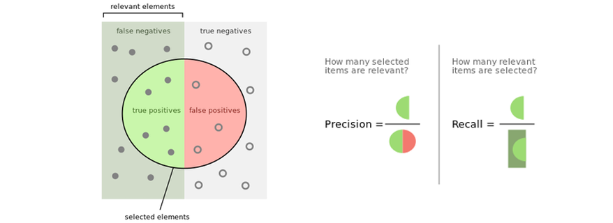
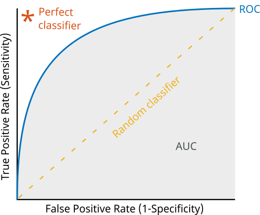
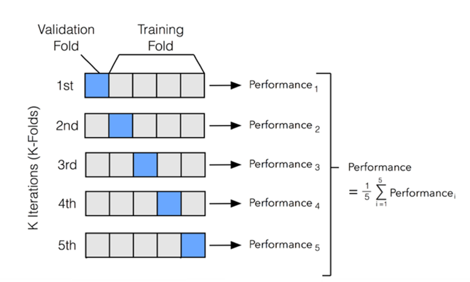

---

## 📚 Session 4 Summary - Machine Learning Zoomcamp

### 1. **🔍 Evaluation Metrics Overview**'

This session delved into different ways of evaluating binary classification models,
particularly focusing on telecom churn prediction.
It highlighted how accuracy alone may be misleading, especially with imbalanced datasets,
and introduced other useful metrics like precision, recall, ROC curves,
as well a cross-validation techniques.

### 2. **📏 Accuracy & Dummy Model**

- **Accuracy**: Fraction of correct predictions among all the predictions. While it seems intuitive, it can be deceptive,
especially with imbalanced data. For example, a **dummy model** that predicts only the majority class can still yield high accuracy.
- **Threshold Optimization**: The default threshold for class assignment is 0.5 but can be optimized for better performance.

### 3. **📊 Confusion Matrix**

- **True Positive (TP)**: Correctly predicted positive cases.
- **True Negative (TN)**: Correctly predicted negative cases.
- **False Positive (FP)**: Incorrectly predicted positives.
- **False Negative (FN)**: Incorrectly predicted negatives.  
  The confusion matrix gives a detailed view of correct and incorrect predictions,
  and can also be normalized to show percentages rather than raw counts.

### 4. **📍 Precision & Recall**

- **Precision**: Measures how many of the predicted positive cases are actually positive.  
  Formula:  $p = \frac{TP}{TP + FP}$
  
- **Recall**: Also known as sensitivity or True Positive Rate (TPR),
measures how many actual positive cases are correctly identified.  
  Formula:  $r = \frac{TP}{TP + FN}$

These metrics are crucial when accuracy falls short, especially in scenarios
where false positives or false negatives carry different costs.

### 5. **📈 ROC Curves & AUC**

- **ROC Curve**: 
The Receiver Operating Characteristic (ROC) originates from the Second World War, during which it was used to evaluate the strength of radio detectors. It was applied to radar signals to determine whether a plane was flying over the radar or not.
The ROC curve evaluates **soft predictions** by plotting True Positive Rate ($TPR = \frac{TP}{TP + FN}$)
against False Positive Rate ($FPR = \frac{FP}{FP + TN}$) to show model performance across different
thresholds.
Note that the $TPR$ should be maximized and the $FPR$ minimized as far as possible.
To get the fpr, tpr and thresholds, it is possible to use: `from sklearn.metrics import roc_curve`.

- **AUC score**: 
The Area Under the ROC Curve reflects the model’s ability to differentiate between classes.
Indeed, it gives the probability that a randomly selected positive sample has a higher score
than a randomly selected negative sample. Thus, a higher AUC score (closer to 1) indicates a better
model, while 0.5 suggests a random model.

### 6. **🔁 Cross-Validation (K-Fold CV)**

- **K-Fold Cross-Validation**: Splits the data into `k` parts, trains the model on `k-1` parts,
and validates on the remaining part. This process is repeated until each part has served as a
validation set at least once.
- **Goal**: Provides a more reliable estimate of model performance, capturing both mean and standard
deviation for metrics like accuracy and AUC. This helps evaluate model stability,
particularly with smaller datasets. For larger ones, it is possible to either use a small number of `k`
or simply split the dataset using the **train - validation - test** framework.

---

### 💡 Key Takeaways

- **Metric:** a single number describing the performance of a model
- **Accuracy:** fraction of correct answers. It is not always reliable, especially with imbalanced data.
- **Precision** (fraction of correct predictions among all positive predictions) and **Recall**
(fraction of correctly identified positive samples) provide deeper insights when evaluating
models in scenarios where one class dominates.
- **ROC Curves** and **AUC** give a robust measure of classifier performance, especially when varying
thresholds.
- **Cross-Validation** ensures a more accurate evaluation of model performance,
providing both the mean and stability (via standard deviation) of metrics across folds.

---