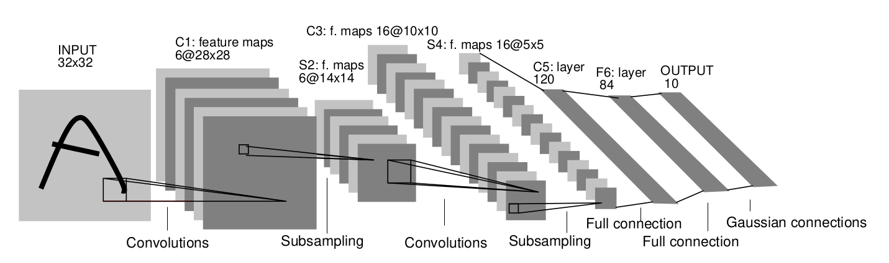

---


## 📚 Session 8 Summary - Machine Learning Zoomcamp

### Fashion Classification

In the previous session, we discussed tabular data and explored models such as linear and logistic regression, along with tree-based models. In this session, we'll shift our focus to image data for a multi-class classification project, leveraging neural networks. Specifically, we will build a fashion classification service that allows users to upload an image and receive its category in return (e.g., T-shirts). The dataset we'll use is a subset of the clothing dataset, featuring its 10 most popular classes. The training dataset is organized into 10 folders, each named after a category and containing the corresponding images. Since the dataset has already been split, no need to perform train-test-validation splits.

This lesson is focused on practical implementation. For a deeper understanding of how neural networks function, refer to this [tutorial](https://cs231n.github.io/).

We will be using `TensorFlow` and `Keras` for training the models. `TensorFlow` is a popular deep learning framework that facilitates the development of neural network models. In this session, we will cover using pre-trained models, an overview of neural network theory, and introduce key concepts like transfer learning (where we fine-tune pre-trained models to solve specific problems), parameters, generalization, and data augmentation.

#### Setting up the Environment on Saturn Cloud

One possibility is to use an SSH key generated from GitHub:
1. Log in to Saturn Cloud and create a secret key to push notebooks to GitHub using SSH. If you haven't already, generate an SSH key on your laptop associated with your GitHub account. Follow this [tutorial](https://docs.github.com/en/authentication/connecting-to-github-with-ssh/generating-a-new-ssh-key-and-adding-it-to-the-ssh-agent).
2. After creating a resource, add your public SSH key when prompted, following the steps outlined [here](https://github.com/DataTalksClub/machine-learning-zoomcamp/blob/master/08-deep-learning/01b-saturn-cloud.md).
3. Once the environment is set up, ensure that `TensorFlow` is installed by importing it and checking its version.

Another option is to use the one generated by Saturn Cloud:
1. **Generate SSH Key on Saturn Cloud**:
   - Access the **Account Management** section of the Saturn Cloud interface.
   - Generate a new SSH key if you don't already have one. The platform often provides an option to copy the generated public key directly.

2. **Add SSH Key to GitHub**:
   - Log in to your GitHub account.
   - Navigate to **Settings > SSH and GPG Keys > New SSH Key**.
   - Paste the copied SSH key and save it.

3. **Test SSH Connection**:
   - Open a terminal on Saturn Cloud.
   - Run the following command to test the connection:
     ```bash
     ssh -T git@github.com
     ```
     If everything is set up correctly, you'll see a message confirming authentication:
     ``` 
     Hi <username>! You've successfully authenticated, but GitHub does not provide shell access.
     ```

4. **Clone Repository**:
   - Use the following command to clone the dataset repository:
     ```bash
     git clone git@github.com:alexeygrigorev/clothing-dataset-small.git
     ```
      This will create a local copy of the dataset in your Saturn Cloud environment.


### TensorFlow and Keras Overview

**TensorFlow** is a powerful library primarily designed for deep learning and machine learning tasks. It provides the foundation for building and training complex neural networks. On top of this, **Keras** acts as a high-level API that simplifies the process of creating, training, and deploying neural networks, making TensorFlow more accessible.

##### Installation
To install TensorFlow, you can use either of the following commands, depending on your package manager:
- Using Anaconda:  
  ```bash
  !conda install tensorflow -y
  ```
- Using pip:  
  ```bash
  !pip install tensorflow
  ```

**Note:**  
If you have a GPU and wish to utilize it for accelerated training, additional setup is required to install the appropriate CUDA and cuDNN libraries to integrate TensorFlow with your GPU.

##### Keras in TensorFlow
Previously, Keras was an independent library. Since TensorFlow 2.0, Keras has been integrated into TensorFlow as its default high-level API, allowing seamless usage.


#### Working with Images in TensorFlow

##### Loading and Preprocessing Images
To load an image, the `load_img` function from `tensorflow.keras.preprocessing.image` or `tensorflow.keras.utils` can be used. Images must often be resized to specific dimensions required by neural networks, such as \( 299 \times 299 \), \( 224 \times 224 \), or \( 150 \times 150 \). Resizing ensures the input matches the network's expected format.

After loading an image, you can convert it into a NumPy array using `np.array()`.

##### Understanding Image Representation
Images are typically represented as a 3D array with the following dimensions:
- **Height** (number of pixels vertically)
- **Width** (number of pixels horizontally)
- **Color Channels** (Red, Green, Blue or RGB)

Example:
- An image with a size of \( 150 \times 150 \) would have an array representation with a shape of `(150, 150, 3)`.

For each pixel, the RGB values are stored in the range of `0` to `255`, where:
- **R** (Red) = Intensity of the red channel
- **G** (Green) = Intensity of the green channel
- **B** (Blue) = Intensity of the blue channel

##### Example
A single pixel with the RGB values `[179, 171, 99]` would mean:
- \( R = 179 \)  
- \( G = 171 \)  
- \( B = 99 \)  

##### Data Type
The pixel values are stored in a `numpy.array` of type `uint8` (unsigned 8-bit integer). This data type is ideal for pixel representation since:
- Each pixel value ranges from `0` to `255` (1 byte or 8 bits per color channel).
- Unsigned integers are used because negative pixel values are not meaningful.

In summary, a typical color image has three channels (RGB), each with an 8-bit representation. Combined, this structure ensures precise color representation for every pixel. This standardized format simplifies how neural networks process and analyze image data.

---

### Pre-Trained Convolutional Neural Networks

#### **Pre-trained Models**
Pre-trained models are neural networks that have been trained on large datasets to recognize and classify images. They serve as a robust foundation for various computer vision tasks by providing a general understanding of visual features.

#### **ImageNet Dataset**
- **Source**: [ImageNet Dataset](https://www.image-net.org/)
- **Overview**:  
  - **Training Set**: 1,281,167 images  
  - **Validation Set**: 50,000 images  
  - **Test Set**: 100,000 images  
- **Purpose**: General-purpose image classification.

#### **Models Trained on ImageNet**
- Pre-trained models available via [Keras Applications](https://keras.io/api/applications/) are trained on the ImageNet dataset.
- We focus on the **Xception** model due to its balance of:
  - Size: 88 MB.
  - Parameters: 22,910,480.
  - Performance: High accuracy.
  - Speed: Efficient computation, ideal for setups with limited resources.

#### **Accelerating Training and Inference**
- **GPU Usage**:
  - **Advantages**: 
    - Parallel processing capabilities.
    - Superior performance in matrix operations crucial for neural networks.
  - **Tools**:
    - **SageMaker** or **Saturn Cloud** for cloud-based GPU access.
    - Use kernel `tensorflow2_p36` when leveraging SageMaker.

- **CPU vs. GPU**:
  - GPUs can be up to 8x faster than CPUs for training and inference tasks.

#### **Functions Specific to Xception**
- **`preprocess_input`**: Prepares batches of images for Xception by normalizing and scaling input.
- **`decode_predictions`**: Translates model outputs into human-readable class names with associated probabilities.

#### **Customizing Pre-Trained Models**
- While ImageNet-trained models are excellent for general image classification, they may lack specificity for certain domains, such as clothing, where classes like *t-shirt* may not exist.
- **Solution**:
  - Build on top of pre-trained models by fine-tuning or transferring learning to adapt to specific datasets, enabling better performance for specialized tasks like clothing classification.

---

### Convolutional Neural Networks

CNNs are specialized neural networks primarily designed for processing image data. They consist of various layers, including:

a. **Convolutional Layers**  
   - **Purpose:** Extract feature representations from the input image.
   - **Mechanism:**  
     - **Filters (or Kernels):** Small, learnable matrices that slide (convolve) over the image to calculate similarities between the filter and the image.  
     - **Feature Maps:** Resultant outputs that indicate how the image features match the filters.
     - **Hierarchy of Complexity:**  
       - Lower layers learn basic patterns (e.g., edges, corners).  
       - Upper layers learn complex patterns formed by combining simpler ones.
   - **Learning:** Filters are not manually defined; they are learned by the network during training.

b. **Dense Layers (Fully-Connected Layers)**  
   - **Purpose:** Use the extracted feature vector to make predictions.  
   - **Structure:**  
     - Every input node is connected to every output node.  
     - Mathematically represented as \( Wx \), where \( W \) is the weight matrix and \( x \) is the input vector.  
   - **Output for Classification Tasks:**  
     - **Binary Classification:** Uses the **sigmoid** function to compute probabilities (e.g., probability of being a T-shirt).  
     - **Multiclass Classification:** Uses the **softmax** function, a generalized version of sigmoid.

c. **Pooling Layers**  
   - **Purpose:** Reduce the dimensionality of feature maps, minimizing the number of parameters while retaining important information.  
   - **Example:** **MaxPooling** selects the maximum value in a region of the feature map.
  


#### **Workflow in CNNs**
1. **Input Image:** Sent through convolutional layers.
2. **Feature Extraction:** Filters generate feature maps to represent patterns in the image.
3. **Vector Representation:** Final feature maps are flattened into a vector.
4. **Dense Layers:** This vector is processed to make predictions:
   - Intermediate dense layers refine internal representations.
   - The output layer produces probabilities for each target class.
5. **Prediction:** Probabilities are used to determine the most likely class.


#### **Example Architecture**



**LeNet-5** is a classic CNN architecture for recognizing handwritten digits. It includes convolutional layers, pooling layers, and dense layers to demonstrate this workflow.

---

### Transfer Learning
Transfer learning is a powerful machine learning approach where a pre-trained model on a large dataset (e.g., ImageNet) serves as a foundation for a new, task-specific model. This method can leverage the feature extraction capabilities of convolutional layers from the pre-trained model while customizing the dense layers to suit the new task. Here's a breakdown of the key concepts:

#### Key Concepts

1. **Pre-Trained Model**:  
   Models like `Xception` or `ResNet` are trained on extensive datasets, learning to extract general features from images. These convolutional layers (referred to as the *bottom* layers) are preserved for their ability to identify complex patterns such as edges and textures.

2. **Freezing Layers**:  
   By setting `base_model.trainable = False`, we freeze the convolutional layers, preventing their weights from being updated during training. This retains their learned feature extraction capabilities.

3. **Dense Layers for Fine-Tuning**:  
   The top layers of the pre-trained model (typically fully connected or dense layers) are discarded because they are specific to the original dataset's classification task. New dense layers are added to adapt to the target task.

4. **Image Size and Batch Processing**:  
   - Resizing images to \( 150 \times 150 \) reduces computational costs, making training faster. Models process smaller images approximately 4 times faster than larger ones (e.g., \( 299 \times 299 \)).
   - Using a batch size of 32 ensures efficient memory usage during training.

5. **Vector Representation via Average Pooling**:  
   The output from the convolutional base is a 3D tensor. Average pooling transforms it into a 1D vector representation, which serves as the input for the dense layers.

6. **Optimizer and Loss Functions**:  
   - **Optimizer**: The `Adam` optimizer is commonly used for its efficiency and adaptability. It updates the model's weights using gradient descent.
   - **Loss Functions**: These measure how well the model predicts the target:
     - `MeanSquaredError` for regression tasks.
     - `CategoricalCrossentropy` for multi-class classification.
     - `BinaryCrossentropy` for binary classification.
   - Specifying `from_logits = True` indicates that the loss function should handle raw predictions (logits) directly, ensuring numerical stability. Adding a `softmax` activation converts logits into probabilities, and `from_logits = False` allow the optimizer to use them for loss computation.

7. **Learning Rate**:  
   The learning rate is a critical hyperparameter. It determines the step size for updating weights during optimization. Proper tuning is essential for achieving good results.

#### Practical Workflow for Transfer Learning
1. Import a pre-trained model (e.g., `Xception`) with `include_top = False` to exclude the dense layers.
2. Freeze the convolutional layers by setting `base_model.trainable = False`.
3. Apply the model to the input data to generate feature maps.
4. Use average pooling to create a 1D vector representation from the feature maps.
5. Add custom dense layers to output predictions for the target task.
6. Compile the model with an appropriate optimizer and loss function.
7. Train the model with the resized dataset using an optimal learning rate.

This approach efficiently adapts powerful models to specific tasks, saving time and computational resources while achieving high accuracy.

---

### Adjusting the learning rate

Imagine you have a book, and you want to read it. The *learning rate* represents how fast you can read and absorb its content. If you read the book very quickly, you risk forgetting important parts and struggling to recall key details when you need to apply them. On the other hand, reading slowly allows you to study each concept thoroughly and understand it deeply, ensuring better retention. However, if you read too slowly, you might never finish the book. The goal is to find the right reading pace, or learning rate, that balances comprehension and efficiency. Reading too fast may result in superficial understanding, while reading too slowly might mean not acquiring knowledge quickly enough to meet your goals. By maintaining a moderate, balanced pace, you can maximize understanding and effectively apply what you've learned.  

This analogy relates to training machine learning models. Training a model is like reading a book: you're trying to "learn" from the data. Applying that knowledge during testing or validation corresponds to validating the model. If you train the model too quickly (with a high learning rate), it may overfit, memorizing the training data without generalizing well to new data. If you train it too slowly (with a low learning rate), it may underfit, failing to learn enough patterns from the data. A balanced learning rate ensures the model acquires sufficient knowledge and performs well on both training and validation data.  

To illustrate, we defined a function to build a Convolutional Neural Network (CNN), and fine-tuned its learning parameter based on validation data to optimize model performance.  

---

### Checkpointing

Model saving can be performed after each training epoch or when certain conditions are met. During training, the model's performance is typically evaluated on a validation dataset after each epoch. This process often uses callbacks to execute specific actions, such as saving the model when it demonstrates improved performance.

In Keras, the `keras.callbacks.ModelCheckpoint()` function allows you to save the best model based on a specified metric, such as validation accuracy. The `save_best_only=True` parameter ensures that the model is saved only when its performance improves compared to previous epochs.  

Additionally, format specifiers like `%02d` and `%.3f` in file naming are commonly used:  
- `%02d` ensures integers are displayed as two digits, with leading zeros if the number is less than 10.  
- `%.3f` formats a floating-point number with three decimal places.  

This approach optimizes storage and ensures only the most effective model is retained.  


---

### Adding more Layers

---

### Regularization and Dropout

---

### Data Augmentation

---

### Training a Larger Model

---

### Using the Model

---

## **💡 Key Takeaways**
---