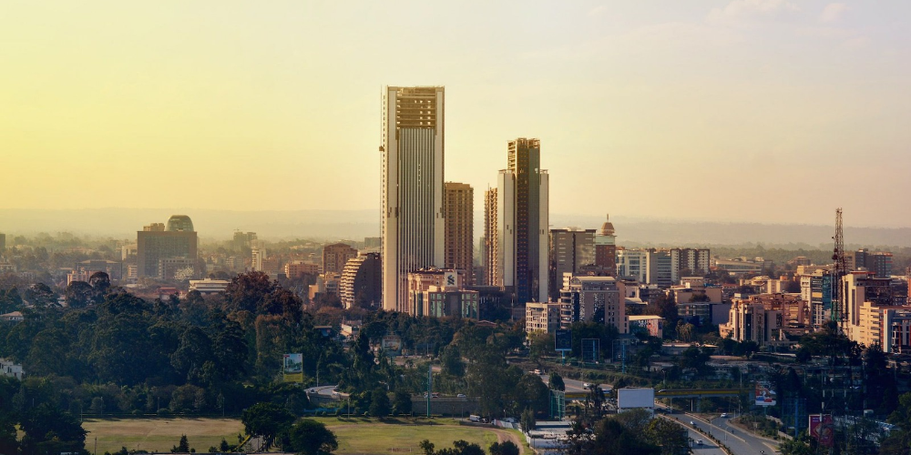
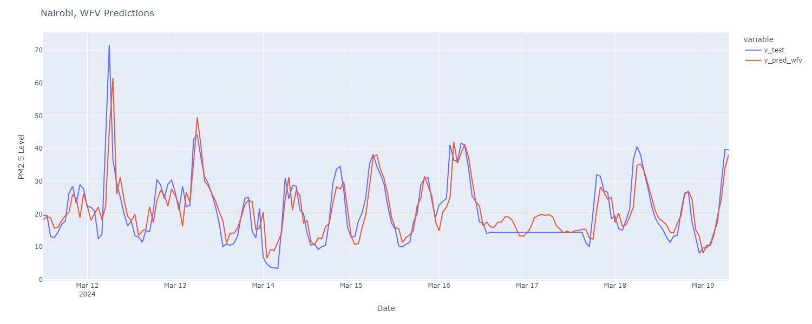

# Nairobi Air Quality Project


## Project Overview
This project focuses on forecasting PM2.5 air quality levels in Nairobi using time series data. The workflow includes data processing, model training, and walk-forward validation (WFV) predictions. Results are visualized to compare actual (`y_test`) and predicted (`y_pred_wfv`) values.

## Project Structure
```plaintext
Diabetes_Predictive_Modelling_Project/
├── README.md                                # This file
├── Nairobi_Air_Quality_Project.ipynb        # Main notebook containing the full analysis, model implementation, and visualization code
├── Nairobi_Air_Quality_Project_dataset.zip  # Dataset zip file
├── config.py                                # Configuration module for MongoDB connectivity using credentials
├── Nairobi.png                              # Nairobi air picture
└── forecasting.png                          # Prediction graph showing PM2.5 levels
```

**Note**: Always secure sensitive credentials in a `.env` file or environment variables in production.

## Results
  
*Predicted vs. actual PM2.5 levels using walk-forward validation.*

---
